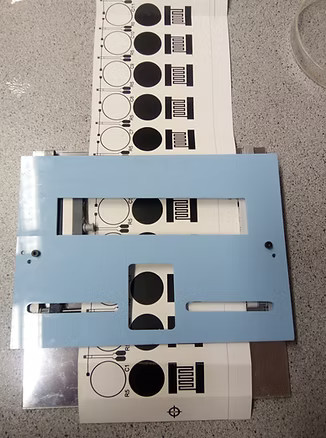

# 1D Automated Sample Conveyor for Terahertz Spectroscopy

## Overview

This repository contains design files and documentation for a custom-built 1D automated sample conveyor designed specifically for terahertz spectroscopy applications. The system was developed to address space constraints in the TeraView terahertz spectrometer while enabling precise one-dimensional sampling of materials.

## Design Features

- **Compact Form Factor**: Designed to fit within the restricted mounting space of the TeraView terahertz spectrometer
- **Aluminum Base**: Provides structural support while being transparent to terahertz radiation
- **Acrylic Top Cover**: Precision-cut with specific apertures for the rubber roller and sample viewing/access
- **Automated Movement**: Controlled via an Arduino with a motor shield
- **Friction-Enhanced Sample Transport**: Implemented using a rubber roller for reliable paper/sample movement

## Hardware Components

- Aluminum base plate
- Laser-cut acrylic top cover with precision slots
- Rubber roller (fits in the largest slot of the acrylic cover)
- Arduino microcontroller with motor shield
- Connection system to CNC mill for precision control
- Sample papers with test patterns (as shown in the image)

## Assembly Notes

The device consists of three main components:
1. An aluminum base that provides structural integrity
2. An acrylic top cover with precision-cut slots for:
   - Sample viewing/access
   - Rubber roller placement
3. A removable rubber roller (not shown in the image) that fits into the largest slot in the blue acrylic cover

## Operation

The conveyor system is controlled using a combination of:
- Arduino with motor shield for roller control
- CNC mill and laser cutter for precise positioning
- The rubber roller provides friction with the sample paper for smooth movement

## Applications

This device was custom-built for TeraView to enable 1D sampling in their terahertz spectrometer where space constraints previously limited sample mounting options. The thin profile of this system allows it to be mounted directly into the spectrometer for automated one-dimensional scanning of samples.

## Future Improvements

Potential improvements to consider:
- Further size optimization
- Additional automation capabilities
- Integration with spectrometer software
- Sample position feedback mechanism

## License

[Add your preferred license here]

## Contact

[Add your contact information here]
